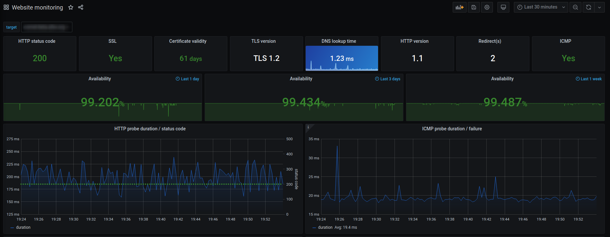

# website-monitoring

Monitore your websites availability with
* [Prometheus](https://github.com/prometheus/prometheus)
* [Prometheus blackbox exporter](https://github.com/prometheus/blackbox_exporter)
* [Grafana](https://github.com/grafana/grafana)

## Dependencies

* [docker](https://docs.docker.com/install/)
* [docker-composer](https://docs.docker.com/compose/install/)

## Usage

* Edit `config/prometheus/targets.yml` (see targets.yml.example) or use `./gen_target.sh`
* Create and start containers `docker-compose up -d`
* [Visualize dashboards](http://localhost:3000/)

If you already have Prometheus and Prometheus blackbox exporter up and running just import the dashboards ([website-monitoring](website-monitoring.json) or [overview](overview.json)) and use the right [datasource](screenshots/import.png) and [jobs](screenshots/import.png) (http_job and icmp_job)

## Dashboards

* Website monitoring
  * HTTP status code
  * HTTP redirects
  * HTTP version
  * TLS version
  * Certificate validity
  * ICMP
  * DNS lookup time
  * Availability over the last 24 hours, 3 days and 7 days
  * Probe duration and status code history

* Overview
  * Total number of targets
  * Percentage of invalid status code
  * Percentage of available targets
  * Percentage of targets using SSL
  * global invalid status code history

## PromQL

Some useful PromQL queries

* Number of days till certificate expiration
  * `(probe_ssl_earliest_cert_expiry{instance=~"$target",job="website-monitoring-http"} - time()) / (60*60*24)`
* Display bad HTTP status code
  * `probe_http_status_code{job="website-monitoring-http",instance="$target"} != 200`
* Count the number of each status code
  * `count_values("code", probe_http_status_code)`
